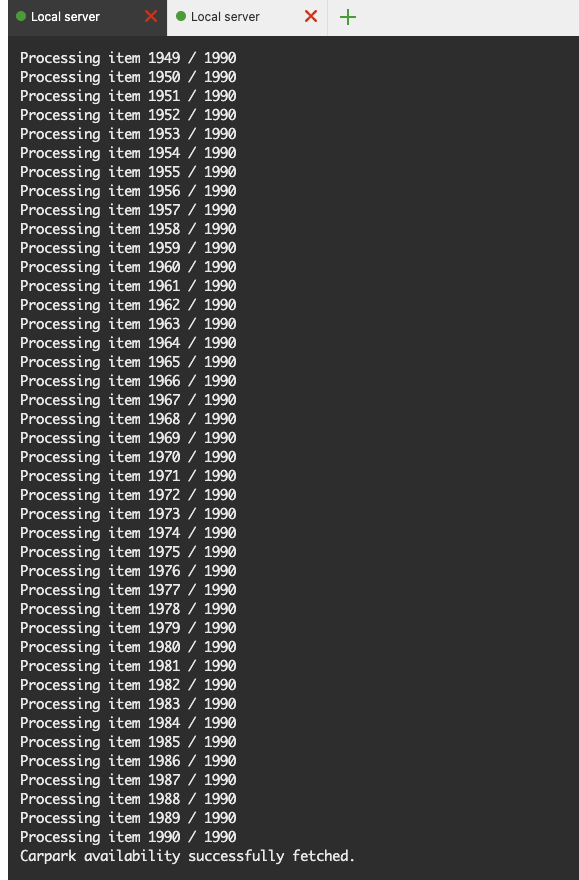

# JWT Springboot for Wego Test
This project for Wego test only.pleae install mySQL and restore the table first.
Make sure your IDE lombok support.

## Usage

```python
run project: mvn spring-boot:run
or 
java -jar target/test-iwan-0.0.1-SNAPSHOT.jar
```

## Endpoints
```python
GET /carparks/v1/nearest

curl --location 'https://wego-test-iwan.lihatkebunku.cloud/carparks/v1/nearest?latitude=1.37326&longitude=103.897&page=1&per_page=10'

Response:
[
  {
    "address": "BLK 464-468 HOUGANG AVENUE 10",
    "latitude": 1.3732591319490541,
    "longitude": 103.89696590280224,
    "total_lots": 433,
    "available_lots": 254
  },
  {
    "address": "BLK 401-413, 460-463 HOUGANG AVENUE 10",
    "latitude": 1.3742926629562835,
    "longitude": 103.89581761240308,
    "total_lots": 705,
    "available_lots": 177
  },
  {
    "address": "BLK 414-416 HOUGANG AVENUE 10",
    "latitude": 1.3754154819944029,
    "longitude": 103.89650246570729,
    "total_lots": 85,
    "available_lots": 17
  }
]

```
## Docker

```python

COPY target/test-iwan-0.0.1-SNAPSHOT.jar to docker directory
RUN ./build.sh

```

## Fetching Data

```python

The system will automatically fetch data from the endpoint https://api.data.gov.sg/v1/transport/carpark-availability every 3 minutes.
If you want to disable automatic fetching, set the value of ___carpark.api.canFetch___ to false.

The fetching schedule can also be adjusted as needed by modifying the value of ##### carpark.cron



```
